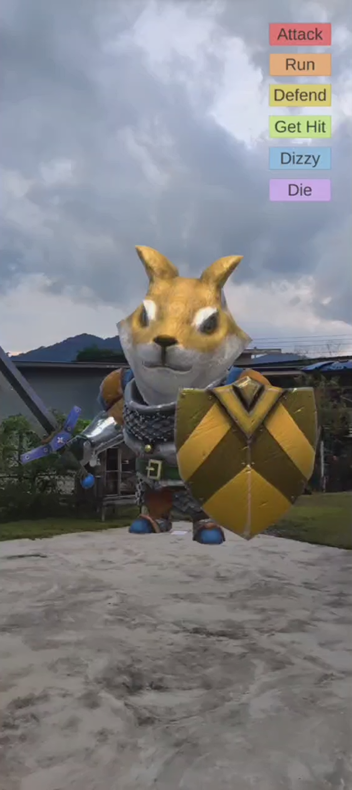
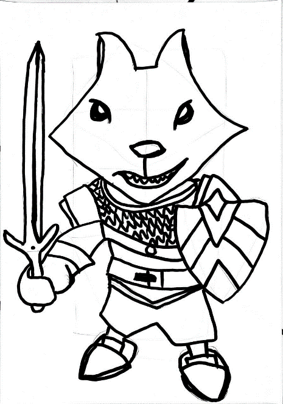
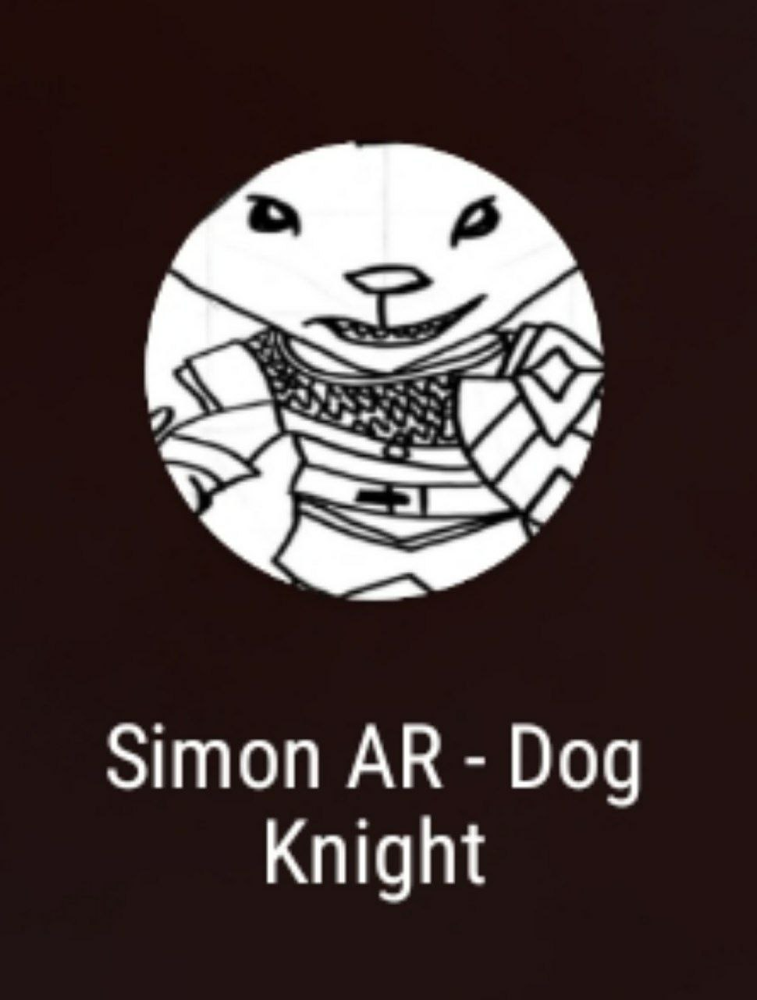

# Target-AR-Button-Control-Animation

### This is the interface you will see if you run the apk.

 

### This is the image target when you capture it with your AR camera.

 

### The icon of apk on an Android phone.

